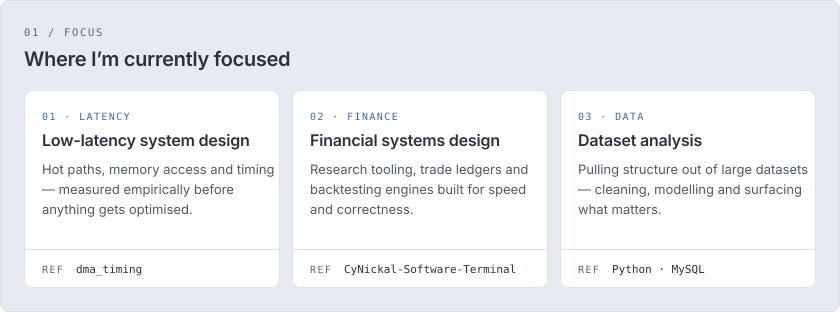
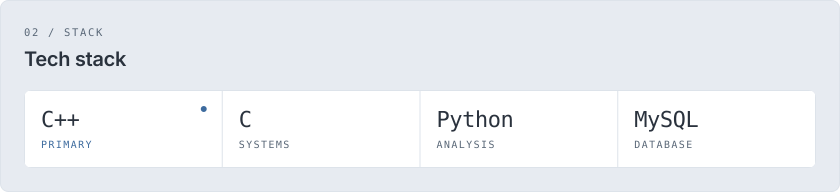
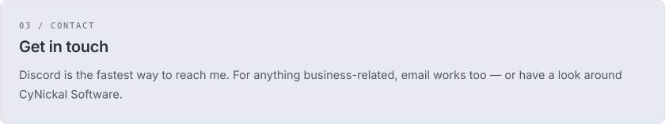

<!-- Cards are generated by tools/build.py in the Stratum theme from cynickalsoftware.com. Edit CONTENT there and re-run. -->

<a href="https://cynickalsoftware.com/">
  <picture>
    <source media="(prefers-color-scheme: dark)" srcset="assets/dark/hero.svg">
    
  </picture>
</a>

<picture>
  <source media="(prefers-color-scheme: dark)" srcset="assets/dark/focus.svg">
  
</picture>

<picture>
  <source media="(prefers-color-scheme: dark)" srcset="assets/dark/stack.svg">
  
</picture>

<picture>
  <source media="(prefers-color-scheme: dark)" srcset="assets/dark/contact.svg">
  
</picture>

  <a href="https://cynickalsoftware.com/"><picture><source media="(prefers-color-scheme: dark)" srcset="assets/dark/btn-site.svg"></picture></a>
  <a href="mailto:cynickal@cynickal.com"><picture><source media="(prefers-color-scheme: dark)" srcset="assets/dark/btn-email.svg"></picture></a>
  <picture><source media="(prefers-color-scheme: dark)" srcset="assets/dark/btn-discord.svg"></picture>

